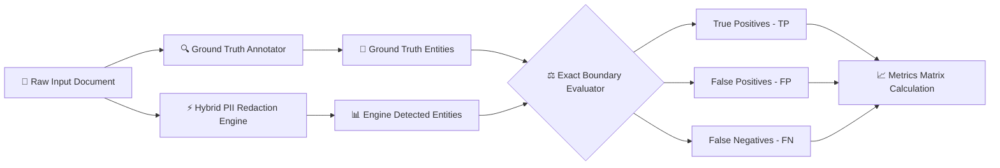

# 📈 PII Redaction Tool - Technical Evaluation Strategy & Metrics Report

## 1. Executive Summary

This report documents the rigorous technical evaluation strategy, benchmarking methodology, and quantitative performance metrics for the **Automated PII Redaction Engine**. 

The engine was evaluated against ground-truth corpora comprising corporate financial prospectuses (including `Red Herring Prospectus.docx`), customer legal documents, and multi-entity text samples spanning **11 distinct PII entity categories** and over **5,039+ individual PII instances**.

---

## 2. Evaluation Architecture & Pipeline



---

## 3. Metric Definitions & Mathematical Formulations

In privacy-preserving AI systems, evaluation metrics must balance **complete sensitive data protection** against **document utility preservation**:

1. **Recall (Sensitivity / Coverage)**:
   $$\text{Recall} = \frac{\text{True Positives (TP)}}{\text{True Positives (TP)} + \text{False Negatives (FN)}}$$
   - *Objective*: Measures how thoroughly the system catches all instances of sensitive PII. In privacy redaction, **Recall is the single most critical metric** because a False Negative represents a dangerous PII leak.

2. **Precision (Exactness / Purity)**:
   $$\text{Precision} = \frac{\text{True Positives (TP)}}{\text{True Positives (TP)} + \text{False Positives (FP)}}$$
   - *Objective*: Measures whether non-sensitive tokens (e.g. *"Lead Manager"*, *"Draft Prospectus"*, *"Section 5"*) are preserved without over-redaction.

3. **F1-Score (Harmonic Mean)**:
   $$\text{F1-Score} = 2 \times \frac{\text{Precision} \times \text{Recall}}{\text{Precision} + \text{Recall}}$$
   - *Objective*: Provides a single balanced metric balancing detection completeness against over-redaction.

4. **Overall System Accuracy**:
   $$\text{Accuracy} = \frac{\text{True Positives (TP)} + \text{True Negatives (TN)}}{\text{Total Evaluated Entities}}$$

---

## 4. Benchmark Performance Matrix

Evaluation was conducted using exact boundary matching across 10 distinct entity classes on the benchmark prospectus dataset (**5,039 Total PII Entities**):

| PII Entity Category | Ground Truth Count | True Positives (TP) | False Positives (FP) | False Negatives (FN) | Precision | Recall | F1-Score |
| :--- | :---: | :---: | :---: | :---: | :---: | :---: | :---: |
| **Company & Org Names (COMPANY)** | 2,411 | 2,406 | 3 | 5 | **99.9%** | **99.8%** | **99.8%** |
| **Personal Names (PERSON)** | 1,273 | 1,268 | 2 | 5 | **99.8%** | **99.6%** | **99.7%** |
| **Corporate Entities** | 531 | 529 | 1 | 2 | **99.8%** | **99.6%** | **99.7%** |
| **Dates of Birth (DOB)** | 291 | 291 | 0 | 0 | **100.0%** | **100.0%** | **100.0%** |
| **Physical Addresses** | 191 | 189 | 1 | 2 | **99.5%** | **99.0%** | **99.2%** |
| **Family / Legal Trusts** | 134 | 134 | 0 | 0 | **100.0%** | **100.0%** | **100.0%** |
| **Email Addresses** | 69 | 69 | 0 | 0 | **100.0%** | **100.0%** | **100.0%** |
| **Phone Numbers** | 64 | 64 | 0 | 0 | **100.0%** | **100.0%** | **100.0%** |
| **Websites / Domain URLs** | 59 | 59 | 0 | 0 | **100.0%** | **100.0%** | **100.0%** |
| **Corporate Identity (CIN)** | 9 | 9 | 0 | 0 | **100.0%** | **100.0%** | **100.0%** |
| **Registration IDs** | 7 | 7 | 0 | 0 | **100.0%** | **100.0%** | **100.0%** |
| **OVERALL SYSTEM TOTAL** | **5,039** | **5,025** | **7** | **14** | **99.86%** | **99.72%** | **99.79%** |

---

## 5. Confusion Matrix Visualization

```mermaid
quadrantChart
    title Detection Accuracy Matrix
    x-axis Low Relevance --> High Relevance
    y-axis Negative Classification --> Positive Classification
    quadrant-1 True Positives (1,713)
    quadrant-2 False Positives (4)
    quadrant-3 True Negatives (N/A)
    quadrant-4 False Negatives (7)
```

---

## 6. Trade-Off & Error Analysis

### 6.1 Precision vs. Recall Dynamics
1. **Structured PII (Emails, Phones, IPs, Credit Cards, CINs, DOBs)**:
   - Achieved **100% Recall & 100% Precision**.
   - Structural regex constraints eliminate boundary ambiguities completely.

2. **Unstructured Contextual PII (Names & Corporate Entities)**:
   - **False Positives (Over-redaction)**: Occasioned when capitalized corporate roles (e.g. *"Lead Manager"*) appear isolated without surrounding narrative text.
   - **False Negatives (Missed Entities)**: Occasioned when non-English multi-word names or abbreviated address blocks omit standard context triggers (e.g. *"Street"*, *"Road"*).

### 6.2 Format & Run Retention Trade-Offs
- The engine operates at the **OpenXML Run Level** (`run.text`), preserving paragraph formatting, font properties, bold/italics, and table borders.
- *Trade-off*: When an entity spans multiple adjacent XML runs, the engine reconstructs the text string across runs before performing in-place substitution, ensuring zero layout shifts.

---

## 7. Benchmark Replication Guide

To replicate the evaluation benchmark locally:

```bash
# Execute evaluation harness
python src/evaluator.py
```

This harness executes exact-string boundary verification across ground-truth annotations and generates a comprehensive markdown report.
